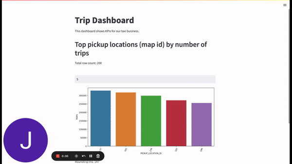
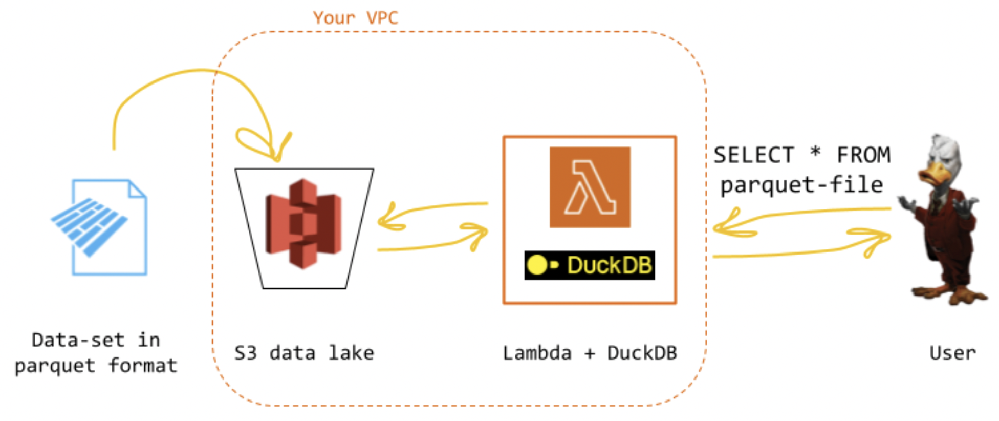

# Quack-reduce
A playground for running duckdb as a stateless query engine over a data lake. 
The idea is to have a zero-maintenance, [very fast](https://www.loom.com/share/96f1fd938c814d0a825facb215546f03) and almost free data engine for small analytics apps. 
This repo is the companion code for this blog post (_forthcoming_). 

Please refer to the blog post for more background information and details on the use case.

## Quick Start ..ε=(｡ﾉ･ω･)ﾉ 

If you read the blog post and know already what we are up to, follow the quick setup steps below to run everything in no time.

### Setup your account

Make sure you have:

- A working AWS account;
- [Docker](https://docs.docker.com/get-docker/) installed and running on your machine;
- Python 3.9+ and Node.js properly installed on your machine;
- A `profiles.yaml` file on your local machine to run the dbt project.

In the `src` folder, you should copy `local.env` to `.env` (do *not* commit it) and fill it with proper values:

| value                 | type | description                                          |                   example |
|-----------------------|------|------------------------------------------------------|--------------------------:|
| AWS_ACCESS_KEY_ID     | str  | User key for AWS access                              | AKIAIO...                 |
| AWS_SECRET_ACCESS_KEY | str  | Secret key for AWS access                            | wJalr/...                 |
| S3_BUCKET_NAME        | str  | Bucket to host the data (must be unique)             | my-duck-bucket-130dcqda0u |

These variables will be used by the setup script and the runner to communicate with AWS services. Make sure the user has the permissions to:

- create a bucket and upload files to it;
- invoke the lambda below.

### Run the project
From the `src` folder:

>**1. Create the DuckDB Lambda:** run `make nodejs-init` and then `make serverless deploy` (after deployment, you can test the lambda is working from the [console](https://www.loom.com/share/97785a387af84924b830b9e0f35d8a1e)).

>**2. Build the Python env:** run `make python-init`.

>**3. Download the data and upload it to S3:** run `make run_me_first` (check your S3 bucket and make sure you find a `partitioned` folder with [this structure](images/s3.png)).

>**4. Test the serverless query engine:** run `make test`.

>**5. Set up your dbt profile:** to run dbt locally, set up a dbt [profile](https://docs.getdbt.com/docs/core/connection-profiles) named `duckdb-taxi` (see [here](https://github.com/jwills/dbt-duckdb) for examples):
```yaml
# ~/.dbt/profiles.yml
duckdb-taxi:
  outputs:
   dev:
     type: duckdb
     path: ':memory:'
     extensions:
        - httpfs
        - parquet
  target: dev
```
>**6. Run the dbt project:** run make `dbt-run`.

>**7. Run the Analytics app:** run `make dashboard`.



Note that every time the input field in the dashboard changes, we run a full round-trip on our engine in the back: it can be *this* fast!

***

## Project Overview

If you want to give it a try, follow the instructions in the `Quick Start` section above to get the system up and running. The rest of the README explores in more details the various components:

* the lambda function running the queries;
* interactions from a local script;
* a serverless BI application;
* running massive parallel workloads through the engine.



> NOTE: this project (including this README!) is written for pedagogical purposes and it is not production-ready (or even well tested!): our main goal is to provide a reference implementation of few key concepts as a starting point for future projects - so, sorry for being a bit verbose and perhaps pedantic at times.

### Duckdb lambda

The `src/serverless` folder is a standard [serverless](https://www.serverless.com/framework/) project, to build an AWS lambda function with Duckdb on it. It has three main components:

- a Dockerfile, which starts from the public AWS lambda image for Python (`public.ecr.aws/lambda/python:3.9`) and add the few dependencies we need;
- an `app.py` file, containing the actual code our lambda will execute;
- a `../serverless.yml` file, which ties all these things together in the infra-as-code fashion, and allows us to deploy and manage the function from the CLI.

The cloud setup is done for you when you run `make nodejs-init` and  `make serverless-deploy` (Step 1 in the setup list above). The first time, deployment will take a while as it needs to create the image, ship it to AWS and create the stack - note that this is _a "one-off" thing_:


> NOTE: you may get a `403 Forbidden` error when building the image: in our experience, this usually goes away with `aws ecr-public get-login-password --region us-east-1 | docker login --username AWS --password-stdin public.ecr.aws`.

### Interacting with the engine

We can use a simple Python script to interact with our engine. First, we can test the system with a hard-coded query. Make sure you run Step 2 and Step 3 in the quick start list (to setup Python and the dataset): now, we can test test everything is working with `make test`.

If all looks good, you can now run arbitrary queries (replacing `MY_BUCKET_NAME` with your value) just by using the provided `python quack.py` script; make sure to manually activate your venv with `source ./.venv/bin/activate`, e.g. you can run

`python quack.py -q "SELECT pickup_location_id AS location_id, COUNT(*) AS counts FROM read_parquet(['s3://MY_BUCKET_NAME/dataset/taxi_2019_04.parquet']) WHERE pickup_at >= '2019-04-01' AND pickup_at < '2019-04-03' GROUP BY 1 ORDER BY 2 DESC"`

to get the most popular pickup location (IDs) for the first few days of April. 

Since the amount of data that can be returned by a lambda is limited, the lambda will automatically limit your rows if you don't specific a limit in the script. You can get more data back with:

`python quack.py -q ... -limit 100`

but be mindful of the infrastructure constraints!

### Serverless BI architecture (Optional)

If you want to see how this architecture can bridge the gap between offline pipelines preparing artifacts, and real-time querying for BI (or other use cases), you can simulate how a dbt project may prepare a view that is querable in a dashboard, through our engine (check our blog post for some more context on this use case). 

The quickest setup is running dbt locally, so you need to set up a dbt [profile](https://docs.getdbt.com/docs/core/connection-profiles) named `duckdb-taxi` (see [here](https://github.com/jwills/dbt-duckdb) for examples):

```yaml
# ~/.dbt/profiles.yml
duckdb-taxi:
  outputs:
   dev:
     type: duckdb
     path: ':memory:'
     extensions:
        - httpfs
        - parquet
  target: dev
```

> NOTE: since we run dbt through `make` (see below), there is no need to add credentials to the `extensions`. If you prefer to run it manually, your dbt profile should look more like this:

```yaml
# ~/.dbt/profiles.yml
duckdb-taxi:
  outputs:
   dev:
     type: duckdb
     path: ':memory:'
     extensions:
        - httpfs
        - parquet
     settings:
        s3_region: us-east-1
        s3_access_key_id: YOUR_S3_USER
        s3_secret_access_key: YOUR_S3_KEY
  target: dev
```

After the dbt setup is completed, you can use again the `make` file to run a "batch pipeline" that produces an artifact in S3 from raw data: just type `make dbt-run` to materialize our view as a parquet file:


> NOTE: different warehouses would need different configurations to export the node to the same location, e.g. [Snowflake](https://docs.snowflake.com/en/user-guide/script-data-load-transform-parquet). 

To run the front-end (a dashboard built with streamlit querying the view we materialized) run `make dashboard`. A page should open in the browser, displaying a chart:


You can use the form to interact in real time with the dataset (video [here](https://www.loom.com/share/9d5de3ba822a445d9d117225c1b0307f)), through the serverless infrastructure we built.

### From quack to quack-reduce (Optional)

As we mention in the blog post, the staless execution of SQL over an object storage (and therefore, using duckdb not really as a db, but basically as "just" a query engine) coupled with the parallel nature of AWS lambdas opens up interesting optimization possibilities.

In particular, we could rephrase (some) SQL queries through a map-reduce programming pattern *with other SQL queries*, and execute them all at the same time. To consider a trivial example, a query such as:

`SELECT COUNT(*) FROM myTable WHERE DATE BETWEEN 04/01/2022 AND 04/05/2022`

can be rewritten as the SUM of the results of these smaller queries:

`SELECT COUNT(*) FROM myTable WHERE DATE BETWEEN 04/01/2022 AND 04/02/2022` +
`SELECT COUNT(*) FROM myTable WHERE DATE BETWEEN 04/02/2022 AND 04/03/2022` +
...

As the number of files increases (as in a typical hive-partitioned data lake), scanning the object storage (in duckdb syntax `parquet_scan('folder/', HIVE_PARTITIONING=1)`) may take much longer than reading single _k_ files directly through ideally _k_ parallel functions, drastically improving query performances.

To test out this hypothesis, we built a script that compares the same engine across different deployment patterns - local, remote etc. You can run the bechmarks with default values with `make benchmark`. The script is minimal, but should be enough to give you a feeling of how the different setups perform compared to each other, and the trade-offs involved (check the code for how it's built, but don't expect much!).

[A typical run](https://www.loom.com/share/18a060b89a6a4f6d814e06ffa2674b13) will result in something like the following table (numbers will vary, but the layout should be the same):


Please refer to the blogpost for more musings on this opportunity (and the non-trivial associated challenges).

> NOTE: if you have never raised your concurrency limits on AWS lambda, you may need to request through the console for an increase in parallel execution, otherwise AWS will not allowed the scaling out of the function.

## What's next?

If you like what you've seen so far, you may wonder what you could do next! There's a million ways to improve this design, some of which more obvious than others - as a non-exhaustive list ("left as an excercise to the reader"), this is where we would start:

* if you always query the same table (say, a view for your dashboard), you may want to leverage the `cold` / `warm` pattern in the lambda code to store the table in memory when cold, and read from there (instead of parquet) when warm;

* when you move from one file to multiple files, scanning parquet folders is a huge overhead: wouldn't it be nice to know where to look? While HIVE partitioning is great, modern table formats (e.g. Iceberg) are even better, so you could think of combine their table scan properties with our serverless engine. Performance aside, if you have queried `quack.py`, you know how tedious it is to fully remember the full file name every time: leveraging catalogs like Iceberg, Glue, Nessie etc. would make the experience more "database-like";

* while we now run the query in memory and return a subset of row from the lambda, this pattern is certainly not perfect: on the one hand, sometime we may wish to write back the result of a query (dbt-style, so to speak); on the other, even if analytics queries are often aggregates, result tables may still grow big (row-wise): writing them to s3 and have the client stream back rows from there may be a nice feature to add! 

## License

All the code is released without warranty, "as is" under a MIT License.

This started as a fun week-end project and should be treated with the appropriate sense of humour.
